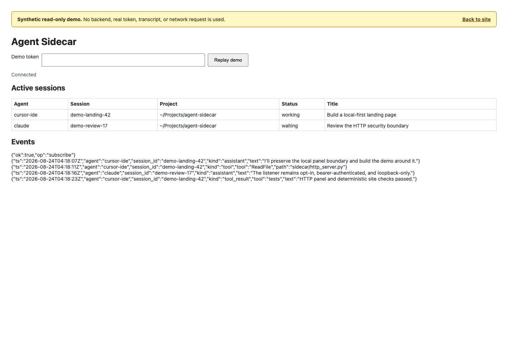

# Agent Sidecar

[English](README.md) | [简体中文](README.zh.md)

[](https://github.com/shendeguize/AgentSideCar/actions/workflows/ci.yml)
[](https://github.com/shendeguize/AgentSideCar/blob/main/pyproject.toml)
[](https://github.com/shendeguize/AgentSideCar/blob/main/pyproject.toml)
[](https://github.com/shendeguize/AgentSideCar/releases/latest)
[](https://github.com/shendeguize/AgentSideCar/blob/main/LICENSE)

[最新版本](https://github.com/shendeguize/AgentSideCar/releases/latest) ·
[网站/演示](https://shendeguize.github.io/AgentSideCar/)

Agent Sidecar 是一个用于观察 AI Agent 会话的本地优先 CLI。它能够发现已持久化的
会话元数据、推断生命周期状态、跟踪规范化事件，并以文本、JSON 或终端仪表盘展示
结果。它还可以通过 SSH 聚合只读的 `list` 和 `status` 快照，并发跟踪本地与远程
事件；在获得明确授权时，也可以启动实验性的本地无头恢复进程来发送消息。可选的
HTTP 面板和 API 会在本机 IPv4 回环地址上公开只读的守护进程数据。

观察类命令不会编辑 Agent 的会话记录、配置或 Hook。`send` 是独立的可变更边界：
恢复后的原生 Agent 可能联系其服务提供方、运行工具并修改 Agent 自有状态。守护
进程会写入自己的套接字和 PID 文件、有界且短暂的私有临时快照，以及轮转的私有
诊断日志。只有明确启用 HTTP 后，它才会额外保存私有的 `http.token`，并在运行期间
维护临时的 `http.port` 记录。发送审计文件由可变更的 CLI `send` 路径写入，而不是
由守护进程的观察路径写入。这些守护进程和审计簿记文件本身不会编辑会话记录或
Agent 配置；但恢复后的原生 Agent 可以按上述方式进行修改。Release 安装程序只
写入所选可执行文件和可选 Skill Bundle；检出版本安装程序则创建集成用符号链接。

0.7.0 版本的本地安装与工具要求 Python 3.9+，且没有 Python 运行时依赖。SSH
目标接受使用 Python 3.8+ 的远程观察载荷。监视 DSH 事件还需要外部 `zstd`
可执行文件。

## 版本 0.7.0

0.7.0 版本提供并发的本地/远程 `watch --all --remote`、持久化的私有发送审计、
请求 ID 幂等性，以及可选启用、仅限数值回环地址的 HTTP 面板。它还包含确定性的
可执行 zipapp、适用于 `pipx` 的包元数据、显式管理的 macOS 用户 LaunchAgent、
具有日志轮转的有界私有守护进程诊断、不可变的私有状态快照，以及可恢复且串行化的
Release 安装。0.7.0 新增面向 Python 3.8+ 目标的远程观察、有界候选解释器探测，
并支持通过 `--remote-python` 或 `AGENT_SIDECAR_REMOTE_PYTHON` 显式指定
失败即关闭的远程解释器。



<a id="support-matrix"></a>

## 支持矩阵

| 环境 | 支持边界 |
| --- | --- |
| macOS | 主要平台和完整质量门禁的目标平台。支持本地观察、远程监控、守护进程和 HTTP 面板、确定性 zipapp、实验性本地 `send`，以及用户 LaunchAgent。 |
| Linux | CI 会验证可移植的观察、远程监控、守护进程/HTTP、TUI 和打包路径。macOS LaunchAgent 不可用；实验性 `send` 所要求的 Darwin `kqueue` 后代进程遏制能力不可用，因此会在执行前关闭失败。在 Agent 自有持久化格式或桌面集成存在平台差异的地方，Linux 支持属于尽力支持。 |
| Windows | 不支持。当前运行时和安全契约依赖 POSIX 权限、文件锁、进程组、Unix 套接字及相关原语。 |
| Python | 本地安装与工具要求 Python 3.9 或更高版本；SSH 目标上的远程观察载荷接受 Python 3.8 或更高版本。CI 使用 Python 3.9 和 3.13 验证本地产品；Agent Sidecar 没有 Python 运行时依赖。 |

操作系统受支持并不代表该系统上的每一种被观察 Agent 都受支持。下文针对各数据源
的边界以及可变更 `send` 的限制仍然是权威说明。

## 支持的本地数据源

下列 Agent 名称也是 `list --agent` 接受的精确取值：

- `cursor-ide`：Cursor IDE JSONL 会话记录和相关终端元数据。支持会话发现、状态
  推断、事件监视和已知的子 Agent 关系。
- `cursor-cli`：通常会先将 Cursor CLI 的 `store.db` 及其 WAL 复制到有界的私有
  临时快照，再进行解码。元数据回退路径可能改为使用 SQLite
  `mode=ro&immutable=1` 打开实时主数据库；该回退路径不会读取 WAL，也不会获取
  SQLite 锁。支持发现、状态推断、历史回放和新的规范化事件。
- `claude`：Claude Code 项目 JSONL 会话记录，包括已知的 sidechain 和子 Agent
  关系。
- `codex`：Codex CLI rollout JSONL，以及可用时的只读原生状态 SQLite。
- `copilot`：仅支持 GitHub Copilot CLI 的 `workspace.yaml` 元数据。0.7.0 版本
  没有对应事件源，因此状态报告为 `idle`。
- `dsh`：优先通过 DeepSeek DSH 投影缓存元数据进行列表和状态查询，并以有界的
  持久会话扫描补充发现缓存缺失的 headless 运行，也支持从压缩会话记录中监视
  事件。`DSH_HOME` 可指定独立的绝对 DSH 存储根目录。基于缓存的列表和状态查询
  无需 `zstd`；持久存储回退发现和监视则需要。持久存储回退会先绑定普通转录
  文件再解码，只接受带非空绝对 `cwd` 的规范顶层元数据；4096 个条目的扫描未
  完整结束或出现重复会话身份时关闭失败。它最多解码 256 个候选，拒绝超过
  64 MiB 的压缩输入；每个解码候选有 3.5 秒硬上限，且完整扫描始终受同一个
  5 秒总硬截止时间约束。每个 adapter 实例只解析并绑定一次 `zstd`，后续扫描
  复用该资源：Linux 从固定的 no-follow 可执行文件描述符启动，macOS 则执行来自
  该描述符的私有快照，因此替换原路径不会改变实际运行的程序。绑定支持显式关闭，
  并有 finalizer 兜底清理；若初始化绑定失败，投影缓存发现仍然可用。有界的
  device/inode/size/mtime/ctime 头缓存只保存成功或确定无效的解码结果，瞬态失败
  会在后续扫描中重试。
- `kimi`：Kimi Code 会话索引、状态和 wire JSONL，包括发现到的子 Agent。优先
  使用 `KIMI_CODE_HOME`，否则使用 `~/.kimi-code`。

对本地工具自有持久化格式的支持均为尽力支持。适配器故障会被隔离，因此一个无法
读取的数据源不会阻止其他 Agent 被列出。

## 安装

请选择一种 CLI 安装方式。本文档没有声称 Agent Sidecar 已发布到 PyPI，因此不要
假设 `pipx install agent-sidecar` 会解析到本项目。

推荐的 Release 渠道是仓库根目录安装程序。请从受保护的 `main` 分支下载，完整
检查文件内容，再运行本地副本：

```sh
installer="$(mktemp)"
curl --fail --location --proto '=https' --tlsv1.2 --output "$installer" \
  https://raw.githubusercontent.com/shendeguize/AgentSideCar/main/install.sh
${PAGER:-less} "$installer"
sh "$installer" --version v0.7.0
rm "$installer"
```

省略 `--version v0.7.0` 时会解析最新稳定 GitHub Release。脚本使用 Python 解析
Release 元数据，要求精确匹配带版本号的 zipapp 和 `SHA256SUMS` 资产，在 macOS
上使用 `shasum -a 256`、在 Linux 上使用 `sha256sum` 验证校验和，之后才会原子
替换 `~/.local/bin/agent-sidecar`。可用 `--prefix <path>` 选择其他前缀，用
`--with-skill` 安装两个 Agent Skill 文件。脚本绝不读取或发送凭据。

仅为方便起见，下面的紧凑形式会下载并立即执行同一个安装程序：

```sh
curl -fsSL --proto '=https' --tlsv1.2 \
  https://raw.githubusercontent.com/shendeguize/AgentSideCar/main/install.sh | sh
```

该单行命令通过 TLS 信任受保护 `main` 的当前内容，不提供本地检查步骤。应优先
使用上面的“下载—检查—运行”流程。脚本仍会验证 Release 产物校验和；该校验和并不
认证安装程序自身的字节。

### 使用 pipx 安装

从已有的 Git 检出版本安装控制台命令：

```sh
pipx install .
```

也可以直接从 Git 安装：

```sh
pipx install 'git+https://github.com/shendeguize/AgentSideCar.git'
```

如需安装已发布且不可变的修订版，可在对应标签可用后，将标签（例如 `@v0.7.0`）
附加到 Git URL 后。两种方式都会创建隔离环境并安装 `agent-sidecar`；该包没有
Python 运行时依赖。

### 安装 GitHub Release zipapp

如需手动安装，GitHub Releases 会发布可执行 zipapp 及其校验和文件。以 0.7.0
版本为例：

```sh
version=0.7.0
curl -fLO "https://github.com/shendeguize/AgentSideCar/releases/download/v${version}/agent-sidecar-${version}.pyz"
curl -fLO "https://github.com/shendeguize/AgentSideCar/releases/download/v${version}/SHA256SUMS"
shasum -a 256 -c SHA256SUMS
chmod +x "agent-sidecar-${version}.pyz"
./agent-sidecar-${version}.pyz --version
```

必须使用同一个 Release 中配套的校验和文件。若要在不安装 Python 包的情况下将
已验证的产物公开为 `agent-sidecar`：

```sh
mkdir -p "$HOME/.local/bin"
install -m 0755 "agent-sidecar-${version}.pyz" "$HOME/.local/bin/agent-sidecar"
agent-sidecar --version
```

请确保 `~/.local/bin` 位于 `PATH` 中。发布工作流会在发布前于 macOS 验证 zipapp，
并附加构建来源证明。Release 产物不代表项目已发布到 PyPI。

### 构建确定性 zipapp

通过当前生效的 Agent Sidecar 命令构建：

```sh
agent-sidecar package build --output dist/agent-sidecar.pyz
```

在检出版本中，`./agent-sidecar package build --output
dist/agent-sidecar.pyz` 与上述命令等价。

该命令会原子地创建权限模式为 `0755` 的可执行文件，并输出其路径、SHA-256 摘要和
大小。它会打包当前生效、已安装的 `sidecar` 包：通过检出版本运行时使用检出版本
源码；通过 pipx 或 wheel 环境运行时使用已安装的 site-packages；通过已有 zipapp
运行时使用其内嵌包。它不会隐式打包 Shell 当前工作目录。相同的有效包内容会产生
确定性一致的重复构建。可以直接运行，也可以通过隔离的 Python 运行：

```sh
./dist/agent-sidecar.pyz --version
python3 -I dist/agent-sidecar.pyz --version
```

如果产物在传输中丢失了可执行位，请先用 `chmod +x agent-sidecar.pyz` 恢复，再用
它启动后台守护进程或安装服务。

### 使用仓库检出版本

在仓库根目录运行：

```sh
sh scripts/install-skill.sh
```

安装程序会创建以下符号链接：

- `~/.local/bin/agent-sidecar`
- `~/.cursor/skills/agent-sidecar`
- `~/.claude/skills/agent-sidecar`
- `~/.dsh/skills/agent-sidecar`

请确保 `~/.local/bin` 位于 `PATH` 中。这些链接指向当前检出版本，因此请保持仓库
位置不变；移动后应重新运行安装程序。对指向当前仓库的链接重复安装是幂等的；
脚本会拒绝覆盖无关文件、目录或符号链接。若只删除当前检出版本拥有的链接，请参见
[卸载](#uninstall)。

希望 CLI 和各 Agent Skill 链接持续跟随工作树的用户可以使用此检出版本安装
程序。它与 `pipx` CLI 安装互为替代方案，因为两者通常都使用
`~/.local/bin/agent-sidecar`。

安装并非必需，也可以直接从仓库运行：

```sh
./agent-sidecar --version
./agent-sidecar status
```

下文所有示例都可以把 `agent-sidecar` 替换为 `./agent-sidecar`。

`daemon start` 会在脱离终端前，把当前生效的 pipx 控制台脚本、可执行 `.pyz` 或
检出版本 shim 解析为稳定的绝对命令。因此守护进程启动后不依赖 Shell 的当前工作
目录。检出版本或 zipapp 正在使用时，请将其保留在解析得到的位置；移动或删除前，
请遵循下文的服务更新流程。

<a id="uninstall"></a>

## 卸载

只执行与实际安装方式对应的步骤。在删除持久进程使用的可执行文件前，先停止这些
进程：

```sh
agent-sidecar service uninstall
agent-sidecar daemon stop
```

`service uninstall` 仅适用于 macOS LaunchAgent。它会保留私有运行时目录、诊断
信息、HTTP 令牌和所有发送审计文件。对于根目录 Release 安装程序安装的 zipapp，
请以相同前缀重新运行已检查的脚本：

```sh
sh /path/to/inspected/install.sh --uninstall
```

它只会删除包含 Agent Sidecar 包签名和有效内嵌版本元数据的普通 zipapp，并拒绝
无关文件或符号链接。添加 `--with-skill` 时，只删除可识别的已复制 Skill Bundle
或检出版本 Skill 链接。对于 `pipx` 安装：

```sh
pipx uninstall agent-sidecar
```

对于检出版本安装程序创建的链接，请在该检出版本中运行：

```sh
sh scripts/install-skill.sh --uninstall
```

对于手动复制到上文精确路径的 Release zipapp，请先确认该文件就是自己安装的
Agent Sidecar 产物，再删除它：

```sh
rm "$HOME/.local/bin/agent-sidecar"
```

正常卸载不包括删除 `~/.agent_sidecar`。删除它可能破坏诊断信息、HTTP 令牌、发送
审计记录和请求 ID 幂等历史。不要把 `audit reset` 当作卸载命令。

## 命令

版本和会话发现：

```sh
agent-sidecar --version
agent-sidecar list
agent-sidecar list --all
agent-sidecar list --agent cursor-ide --agent claude
agent-sidecar list --all --json
agent-sidecar list --remote
agent-sidecar list --remote --host <host-alias> --json
agent-sidecar list --remote --remote-python /usr/bin/python3.11 --json
```

`list` 默认显示最近 48 小时内更新的会话。`--all` 会取消此时间过滤。
`--agent NAME` 可以重复使用，要求精确匹配且不区分大小写。`--json` 输出 JSON
数组。

进程和活跃状态视图：

```sh
agent-sidecar ps
agent-sidecar ps --json
agent-sidecar status
agent-sidecar status --json
agent-sidecar status --remote
agent-sidecar status --remote --host <host-alias> --json
agent-sidecar status --remote --remote-python /usr/bin/python3.11 --json
```

`ps` 报告受支持的本地 Agent 可执行进程；进程存在只是辅助证据，无法可靠归属到
某一个会话。`status` 只包含 `working` 和 `waiting` 会话。

### 远程列表与状态

`list --remote` 和 `status --remote` 会把本地快照与 DSH Center 清单中符合条件的
主机合并。`--host <host-alias>` 可重复使用、不区分大小写，并且只有与 `--remote`
一起使用时才有效；它会限制远程目标，但绝不会移除本地行。
`--remote-python <absolute-path>` 也只能与 `--remote` 一起使用，并为该次调用中
所有选中主机固定同一个解释器路径。这是机群级选项，不提供逐主机远程解释器配置。

远程人类可读输出会增加 `HOST` 列。远程 JSON 会给每一行增加 `host`：`local`
表示本地来源，每个远程行则携带清单提供的主机别名。不带 `--remote` 的本地命令
保持原有会话模式，不增加 `host`。

可用时通过 `dshc ls --json` 获取清单；严格回退路径是 `DSHC_HOME` 或
`~/.dsh_center` 下的 DSH Center 配置/状态文件。只会查询处于合格阶段、已启用、
非本地且非孤立的主机。远程 `list` 与本地 `list` 使用相同的默认 48 小时时间窗；
`--all` 会从本地和远程请求全部可用历史。

DSH Center 主机清单边界保持窄化，并作为 C1–C4 跨仓契约共享。C1 接受裸 HostView
数组或 `{"hosts": [...]}` 容器。Sidecar 只消费 `name`、`config.enabled`、
`config.local`、`local`、`orphaned` 和 `phase`；额外的 HostView 字段会被忽略。
主机只有在已启用、非本地、非孤立且阶段为 `ready` 或 `no_dsh` 时才符合条件。
Map 形式的主机容器仅支持 C4 配置/状态文件回退，不属于 C1 的生产方数据形态。
生产方契约见 [DSH Center handbook](https://github.com/shendeguize/DSH_Center)。
C5 隧道插件页面形态继续通过跨仓集成 Issue 模板追踪。

Sidecar 会从当前生效、已安装的 `sidecar` 包构建有界 zipapp，并通过非交互 SSH
进行流式传输：从检出版本运行时来源为检出版本；从 pipx 或 wheel 运行时来源为
site-packages；从 zipapp 运行时来源为内嵌包。远程无需安装 Agent Sidecar 或任何
第三方 Python 包。传输前会严格按以下有界顺序探测目标：`python3`、
`python3.14`、`python3.13`、`python3.12`、`python3.11`、`python3.10`、
`python3.9`、`python3.8`，并使用首个可用且版本不低于 Python 3.8 的候选。
候选名称通过远程非交互 SSH Shell 可见的 `PATH` 解析，该 `PATH` 可能不同于
交互式登录时的 `PATH`。

解释器选择采用严格优先级：`--remote-python`，其次是
`AGENT_SIDECAR_REMOTE_PYTHON`，最后是有界默认候选。该环境变量同样作用于整个
机群，并且只会在启用远程模式的 `list`、`status` 和 `watch` 中读取；非远程调用
会忽略它。显式值必须是非空绝对路径，长度不超过 1024 个字符，只包含
`[A-Za-z0-9._+/-]`，且不含 `..` 路径段。无效的 CLI 或环境变量值会在发起任何
SSH 连接之前于本地以退出码 `2` 拒绝。

SSH 要求主机密钥已经受信任，并且非交互认证可用。它不会登记主机密钥，也不会
回退到交互提示。探测使用 `sh -c` 只是为了固定内层候选循环的 POSIX 语法；外层
命令字符串仍由远程登录 Shell 解析。既有的多行 bootstrap 已经建立了这一 Shell
边界，远程执行并非与 Shell 无关。使用有界默认发现时，达标解释器返回且通过校验的
可执行文件路径只在同一次主机会话中供紧随其后的 bootstrap 复用。每次调用都会重新
探测，不在本地或远程缓存或持久化。临时 zipapp 由该解释器执行，并在快照完成后
删除。若有界候选全部耗尽，该主机仍使用稳定错误码 `python_too_old`；不新增错误码。

显式解释器会作为一个独立 argv token 传给同一份固定探测脚本；用户数据绝不会
插入脚本文本。该显式路径是探测时唯一的候选，bootstrap 会逐字使用同一个运维方
token。探测响应的所有字段仍会完整校验，但不同的返回 `executable` 不能替换显式
固定值。如果该路径在某台主机上缺失、不可执行或低于 Python 3.8，该主机报告
`python_too_old` 并关闭失败，不会再尝试默认候选或 `python3`。逐主机故障之后，
本地至多输出一条聚合提示，用不同文案区分显式固定失败与有界默认候选耗尽，并在
适用时指向 `--remote-python` 和 `AGENT_SIDECAR_REMOTE_PYTHON`。

远程故障按主机隔离，并在 stderr 上使用稳定错误码报告，其中有界数据违规对应
`resource_limit`。本地行和成功远程主机的行仍会输出。机群部分成功时退出码为
`0`。符合条件的机群为空时也以 `0` 退出，并提示只显示本地会话。清单、初始化或
主机选择无效时退出码为 `2`；只有非空的已请求机群中没有任何主机成功时，退出码
才为 `3`。这些快照命令不提供远程消息投递。

可以用唯一的会话 ID 前缀跟踪单个会话，也可以跟踪所有可监视会话：

```sh
agent-sidecar watch <session-prefix>
agent-sidecar watch <session-prefix> --from-start --json
agent-sidecar watch --all
agent-sidecar watch --all --from-start --json
agent-sidecar watch --all --remote
agent-sidecar watch --all --remote --host <host-alias>
agent-sidecar watch --all --remote --from-start --json
agent-sidecar watch --all --remote --remote-python /usr/bin/python3.11 --json
```

会话前缀与 `--all` 互斥。不使用 `--from-start` 时只输出新观察到的事件。
`--from-start` 会先回放可用历史，再继续跟踪。`--json` 每行输出一个规范化事件
对象。直接使用 `--all` 的回退路径会跳过只有元数据的会话，并在 stderr 报告跳过
数量。

### 远程监视

`watch --all --remote` 会并发跟踪本地会话和所有符合条件的远程主机，再将事件
公平地合并到一个流中。`--host <host-alias>` 可重复使用、不区分大小写，并且只
限制远程侧；本地会话始终保留。`--from-start` 同时作用于本地和远程数据源。远程
模式必须使用 `--all`：不支持按 ID 前缀监视远程会话。
`--remote-python <absolute-path>` 沿用远程 `list` 和 `status` 的机群级选项、
环境变量优先级、本地校验与关闭失败语义；不提供逐主机解释器覆盖。

远程模式下的每个事件都带有主机来源。JSON 输出会给每个事件增加 `host`（本地
事件为 `local`，远程事件为清单别名）；人类可读输出会添加固定宽度主机列。不带
`--remote` 的本地监视命令保持原有事件模式和展示形式。

远程监视使用与远程快照相同的 DSH Center 清单和资格规则：主机必须已启用、非
本地、非孤立，并处于 `ready` 或 `no_dsh` 阶段。每台主机使用与远程快照相同的
有界 Python 候选顺序（`python3`，然后从 `python3.14` 依次到 `python3.8`），
并选择首个可用的 Python 3.8+ 解释器。解析使用非交互 SSH Shell 的 `PATH`，它
可能不同于交互式登录环境。`sh -c` 只固定内层探测的 POSIX 语法；外层命令仍由
远程登录 Shell 解析，既有多行 bootstrap 也是如此。使用有界默认发现时，所选
可执行文件路径只供该次主机会话的 bootstrap 复用；显式固定则保留上述运维方提供的
原 token。每次调用都会重新探测，不创建本地或远程缓存。候选耗尽仍报告
`python_too_old`。之后 Sidecar 从当前生效、已安装的 `sidecar` 包确定性构建有界
zipapp，并通过严格的非交互 SSH 进行流式传输。zipapp 被写入远程私有临时文件，
经过预检后以隔离 Python 模式运行，并在清理时删除；远程不需要安装 Agent Sidecar
或第三方 Python 包。

本地、远程和每主机队列都有界。生产者通过背压等待，而不是丢弃已入队事件；公平
排空可防止繁忙主机饿死其他主机。远程版本预检之后，子监视进程生成一个有效事件
或持续存活一秒宽限期，即视为就绪。由于子进程没有内部就绪信号，宽限期之后发生
的静默初始化失败仍可能在就绪之后才报告。

不会自动重连或重试。主机终止性故障会在 stderr 上以稳定错误码和明确的
`events may be missed` 警告报告；本地和成功的对等流会继续运行。如果本地守护
进程订阅断开，既有本地回退警告同样会指出切换过程中可能存在缺口。不得隐藏任何
一种警告。`Ctrl-C` 会取消本地和远程两侧、关闭 SSH 进程组、在有界清理期限内
join 监视工作线程、删除远程临时文件，并以 `130` 退出。

远程监视退出码如下：

- `0`：正常完成；或者远程部分失败，但仍有可用本地数据源或成功远程流。
- `1`：没有可用本地数据源且符合条件的远程机群为空；或者发生其他本地/输出运行时
  故障。
- `2`：用法、清单、初始化或主机选择无效。
- `3`：非空远程机群中的所有主机均失败，且没有可用本地数据源。
- `130`：用户中断。

符合条件的机群为空时会输出 `remote: no eligible hosts; showing local
sessions only`，并在可能时继续本地监视；如果没有可用本地数据源，则以 `1`
退出。远程消息投递仍不受支持。

### 实验性本地发送

`send` 不是观察命令。它会先执行一次直接本地扫描，并解析精确会话 ID 或唯一
前缀：

```sh
agent-sidecar send <session-prefix> "Please review the latest test failure." --allow-write
agent-sidecar send <session-prefix> "Summarize your result." --allow-write --timeout 120 --json
agent-sidecar send <session-prefix> "Retry-safe request." --allow-write --request-id <stable-unique-id> --json
agent-sidecar send <session-prefix> --allow-write -- "-message beginning with a hyphen"
agent-sidecar send <full-session-id> "Use this exact target." --agent claude --exact-session --allow-write
printf '%s' "Keep this out of the agent-sidecar argv." | agent-sidecar send <session-prefix> --message-stdin --allow-write
printf '%s' '<exact-message>' | agent-sidecar send '<full-kimi-session-id>' --agent kimi --exact-session --message-stdin --allow-write --request-id '<stable-unique-id>' --json
```

只能在用户明确要求该消息或操作时使用。`--allow-write` 是强制参数，因为原生
Agent 可以联系其服务提供方、运行工具并修改会话或工作区状态。

`--agent NAME` 把解析范围限制到大小写不敏感的精确 Agent 名称；
`--exact-session` 要求完整会话 ID，并禁用前缀匹配。两者都可独立省略；调用方
已经持有 Agent 与完整会话 ID 时，可同时使用它们形成精确的复合身份绑定。DSH
插件向外部 Agent 注入时总会同时使用这两个参数。

`--message-stdin` 从标准输入读取消息以替代位置参数，因此消息不会出现在
`agent-sidecar` 的 argv、Shell 历史或进程列表中。两种消息来源互斥：必须恰好
提供一种。标准输入按字节读入并施加相同的字节上限，随后必须按严格 UTF-8
解码；消息经过与位置参数完全相同的校验、注入管线、审计身份、回执和退出码。
标准输入必须来自管道或重定向：交互式终端会被用法错误拒绝（退出码 `2`），
而不会静默等待键盘输入；读取期间被中断时以退出码 `130` 退出，且不会发起
任何投递。输入字节按原样使用，因此尾随换行（例如来自 `echo`）会被保留、
计入字节上限并改变审计指纹；上面的示例使用 `printf '%s'` 以避免引入尾随
换行。

`--request-id` 是可选参数。省略时 Sidecar 会创建一个加密随机的不透明 ID；可能
需要重试安全性的调用方应提供并保留自己稳定且唯一的 ID。对相同本地目标、项目和
完全相同消息复用一个已保留 ID，会返回留存的回执，其中 `replayed: true`，且不会
再启动原生进程。对改变后的目标、项目或消息复用 ID 会以 `request_conflict`
失败。仍为 pending 的保留项（包括崩溃遗留项）会作为 `request_pending` 回放，
此时投递状态未知，绝不能自动重试。人类可读输出和 JSON 都会报告 `request_id`
与 `replayed`。
在展示结果前，`send` 还会校验回执中的 Agent、完整会话 ID 与 request ID 是否
与所选请求一致；身份不匹配会关闭失败为投递未知的 `executor_error`。

每次新发送都会被持久化审计预留以关闭失败方式保护。启动进程前，Sidecar 会在
私有运行时目录中写入并同步一个 pending 记录到权限模式为 `0600` 的私有
`audit.jsonl`。原生进程返回后再写入终态回执。当前日志和一个
`audit.jsonl.1` 轮转文件都有界；私有 `audit.key` 的权限模式为 `0600`。记录
包含不透明请求 ID、带密钥的请求/目标 HMAC 和回执元数据。它们不存储消息、响应
或其他内容，不存储无密钥内容哈希或身份哈希、文件系统路径、原生 stdout 或原生
stderr。请求 ID 幂等性只在相关记录仍位于当前日志或轮转日志中时有效。

审计存储会把每个规范运行时命名空间和 HMAC 密钥绑定到有效账户所配置主目录下的
私有锚点，不受可变 `HOME` 环境变量值影响。运行时目录和锚点目录必须由当前用户
拥有且保持私有；路径穿越、符号链接、inode、所有权、权限模式或密钥发生变化时
都会关闭失败。因此 `send` 需要 POSIX 的基于描述符的相对操作、no-follow 和文件
锁支持；这些原语不可用时，该功能不受支持并关闭失败。

该绑定属于持久安全状态。不得为绕过 `unsafe_lock` 而删除、移动、重建或替换
`AGENT_SIDECAR_RUNTIME_DIR`、其中的审计文件或 home 锚点 marker。该错误表示既有
历史或命名空间身份无法证明；删除 marker 不会让重试变安全。默认行为是关闭失败并
保留证据。只有操作者明确开始一条真正新的 request lineage 时，才可以使用新的
owner-private runtime 路径和新 request ID；此后必须保留该新命名空间及其审计历史。
这不是旧请求的恢复或重试。

启动前，`send` 还会在保留的运行时命名空间内获取一个非阻塞、按会话哈希的 POSIX
锁，在锁内重复直接扫描，并重新验证目标身份、资格和数据源新鲜度。它会拒绝并发的
Sidecar 发送，以及已经改变或消失的目标，并持锁直到原生进程退出。启动前的审计
写入失败会拒绝发送且不运行原生进程；启动后的终态审计写入失败会返回
`audit_error`，投递状态未知。

可变更发送还要求确定性的后代进程遏制。在 Darwin 上，Sidecar 会启动一个带门控
的监督进程，安装 `kqueue` 监视器以观察根进程的 fork 和退出活动，重新验证目标，
然后才允许原生目标执行。干净的无 fork 完成可以报告为已投递。任何观察到的 fork
都会保守地报告为 `error_code: "cleanup_incomplete"`，投递状态未知；即使子工作
是同步的、原生根进程以零退出且已捕获响应，也同样如此。绝不能自动重试该结果。
Kimi 会保留该 fork 诊断，但使用下述更严格的持久证据结果规则，且永不报告
delivered。

如果所需遏制原语不受支持，原生目标执行前 `send` 会报告
`containment_unsupported`，投递状态未知。不会进行全进程扫描，也不会杀死未验证
的后代进程；清理仅限于自有根进程/进程组。正因这些限制，任何 fork 都会被视为
投递未知，而不是已证明清理完成。

`send` 不使用守护进程或远程清单，也不会向现有原生进程发送信号。它会启动另一个
原生进程来恢复已持久化的会话。该锁只协调 Agent Sidecar 的发送；单独启动的原生
交互式 Agent 不遵守该锁，仍可能与恢复进程竞争或并发写入历史。状态是推断结果且
可能滞后，因此即使会话报告为 `waiting`，只要它可能仍处于打开或活跃状态，就
不要发送。

符合条件的目标是本地、顶层、处于 `waiting` 或 `idle` 的 `claude`、`codex`、
`cursor-cli` 或 `kimi` 会话。`working`、`dead`、子会话、sidechain 和远程会话
都会被拒绝；`cursor-ide`、`copilot` 和 `dsh` 也会被拒绝。Claude 和 Codex 通过
stdin 接收原生提示词；Cursor CLI 必然通过子进程 argv 接收；Kimi 使用下述受保护
ACP 路径。Claude、Codex 与 Cursor 保持原有的恢复和结果语义。CLI 直接发送仍不
支持 DSH；DSH 注入只存在于 DSH 插件内。

**Kimi Code 0.38.0 受保护恢复。**

Kimi 支持刻意限定为精确版本与手动操作：只接受 Kimi Code `0.38.0`，每条命令只
启动一个独立的 `kimi acp` 进程来恢复持久化根会话。它不是 live inbox，不会附着
既有终端，也不能向进行中的 turn queue 或 steer；因此观察为 `working` 的 Kimi
会话会被拒绝。

写入提示词前，Sidecar 会绑定所选会话、Kimi home、索引行、state 文档、会话目录、
项目来源、主 Agent home 与根 `wire.jsonl` 的原生根身份。ID 和项目文件系统身份
必须一致；所需目录与文件必须满足 owner 安全并由描述符锚定。发送 plan 还会绑定
Kimi package 资产，以及 Node 发行版的 Node 可执行文件和非系统 dylib 闭包。这些
已验证字节会复制到私有、绑定该 plan 的快照；版本与 ACP 初始化从该快照重新探测；
同一项目中另一个 Kimi 或匹配 Node owner 进程会被 owner-process guard 拒绝。
该有界守卫解析规范的 Node 文件参数，包括受支持的 preload/import/loader 形式及
后续脚本参数，而不会把每条很长的普通 Node 命令都归类为 Kimi。在所要求的
owner-safe single-link 可执行文件绑定下，cwd 已消失的普通相对 Node 命令会被忽略；
Kimi argv hint、直接可执行身份匹配、携带此类证据的畸形或超预算输入，以及不安全
或变化后的可执行身份仍会关闭失败。这些是竞态和所有权守卫，不代表请求与模型 turn
之间存在加密绑定。

有界 ACP 序列以空 client capabilities 初始化，列出并精确匹配会话与项目，使用
`mcpServers: []` 恢复，再在发送唯一一条文本 prompt 前选择 Kimi `default` 模式。
Sidecar 不声明 MCP、文件系统或终端 capability。permission 反向请求会收到
`cancelled`；任何 question/approval 路径也通过关闭失败取消，不支持的反向方法会
终止本次运行。消息只存在于 ACP `session/prompt` NDJSON 帧中，绝不会出现在
Sidecar 或原生 Kimi argv。

Kimi 的公开结果边界严于 Claude、Codex 和 Cursor。Darwin fork 可以继续诊断为
`cleanup_incomplete`。若 ACP 仍以 rc `0` 返回、在 `end_turn` settle，且严格持久
root-wire 与 state 证据精确证明匹配 turn 已完成，公开结果是
`outcome: "completed"`、`delivery: "unknown"`，CLI 退出码为 `1`，绝不会是
delivered。没有该证据时，结果仍是 `failed`（或相应的有界 timeout/overflow
outcome）且投递未知。不得使用新 request ID 自动或手动盲目重试同一内容。复用
同一个仍留存的 request ID 最多只会以 `replayed: true` 重放审计结果，绝不会再
启动 Kimi ACP 进程。

消息必须是非空、无 NUL 的 UTF-8，且不超过 16 KiB。超时时间范围为 1–900 秒，
默认 300 秒。执行有界，Agent Sidecar 只尝试一次恢复。超时、原生失败或输出溢出
表示投递状态未知；未知投递绝不能重试，因为 Agent 可能已经收到消息或执行操作。

成功时，人类可读输出是原生最终响应；没有响应时则为投递回执。`--json` 输出一个
结果对象。对于 Claude、Codex 和 Cursor，退出码 `0` 表示原生恢复成功完成且投递
报告为 `delivered`。退出码 `1` 覆盖运行时失败、超时、溢出，以及所有 Kimi
已完成但投递未知的结果；退出码 `2` 表示有效恢复结果产生前的预检或用法拒绝；
中断时退出码为 `130`，投递状态未知。

位置参数消息会出现在 `agent-sidecar` 命令 argv 中，可能被 Shell 历史记录保存，
也可能在进程列表中可见；`--message-stdin` 可以让消息不出现在 Sidecar 命令行
中。无论使用哪种来源，对于 Cursor CLI，提示词仍会出现在原生子进程 argv 中，
因为该上游恢复契约要求 argv 传输。不要使用此命令发送机密。

如果命名空间被移动，但锚点、密钥指纹和保留日志仍能严格验证，可在不丢失请求 ID
历史的情况下修复 inode 绑定：

```sh
agent-sidecar audit rebind --allow-write --confirm REBIND-SEND-AUDIT
```

无法证明可重绑时，reset 是受支持的后备恢复方式。默认 reset 会先将活动审计密钥、
锚点和保留日志归档到 `audit-archive/`，然后启动新的 lineage；已有八个归档时会
拒绝运行，绝不会静默删除归档：

```sh
agent-sidecar audit reset --allow-write --confirm CLEAR-SEND-AUDIT
```

发送正在使用审计命名空间时，reset 会拒绝运行。如需不可逆删除活动状态和全部归档，
必须使用更强的确认文本：

```sh
agent-sidecar audit reset --purge --allow-write --confirm PURGE-SEND-AUDIT
```

这些命令都是显式恢复操作，绝不能用作自动错误处理。`audit_corrupt` 附带
`detail: "namespace_moved"` 时表示可能可以执行 rebind；其他损坏应保持
fail-closed，并使用 reset 归档，不要手动修改。

打开实时终端仪表盘，或渲染一次不含 ANSI 的快照：

```sh
agent-sidecar tui
agent-sidecar tui --once
```

按 `q` 退出交互式仪表盘。

管理可选的每用户守护进程：

```sh
agent-sidecar daemon start
agent-sidecar daemon start --http
agent-sidecar daemon start --http --http-port 43123
agent-sidecar daemon status
agent-sidecar daemon stop
agent-sidecar daemon run
agent-sidecar daemon run --http
```

`start` 启动脱离终端的守护进程，并且是幂等的。`run` 在前台运行相同守护进程，
适合在进程监督器下使用。HTTP 默认关闭，只有 `--http` 才会启用；`--http-port`
要求同时使用 `--http`，取值范围为 `0` 到 `65535`。省略或选择 `0` 会使用临时
端口。

后台 `start` 会等待守护进程和请求的 HTTP 监听器报告就绪。`start` 和
`daemon status` 会报告数值回环 URL 和私有令牌文件路径，但绝不报告令牌。若 HTTP
参数与已运行守护进程不一致，启动会失败，而不会静默改变其配置。

### 持久化 macOS 用户服务

在 macOS 上，需要显式把守护进程安装为当前用户 LaunchAgent：

```sh
agent-sidecar service install [--http [--http-port PORT]] [--force]
agent-sidecar service install
agent-sidecar service install --http
agent-sidecar service install --http --http-port 43123
agent-sidecar service status
agent-sidecar service uninstall
```

服务绝不会自动安装。它会把经过验证的用户 plist 写入
`~/Library/LaunchAgents/com.agent-sidecar.daemon.plist`，在 `gui/<uid>` 域
加载标签 `com.agent-sidecar.daemon`，并同时配置 `RunAtLoad` 和 `KeepAlive`。
对于 pipx、可执行 zipapp 和检出版本 shim，存储的运行时命令都与 cwd 无关。
非 Darwin 系统不支持服务控制，且失败时不会改变服务状态。

相同安装是幂等的。若更改经过验证的定义，包括 HTTP 模式、端口或运行时目录，
除非提供 `--force`，否则会被拒绝：

```sh
agent-sidecar service install --http --http-port 43123 --force
```

`--force` 会有意卸载并替换定义，造成服务中断；失败时会尝试回滚，但回滚本身也
可能不完整。只能在有意替换配置时使用。版本更新时，应先用旧命令卸载服务，就地
更新或替换 pipx 环境、zipapp 或检出版本，再以所需 HTTP 参数重新安装。改变运行时
命令路径之前必须卸载。`service uninstall` 会删除经过验证的 LaunchAgent 并停止
其守护进程，但会保留私有运行时目录及其中的诊断和 HTTP 令牌数据。所有发送审计
文件也会保留，不过它们归 CLI `send` 工作流所有，而不是守护进程观察路径所有。

## 状态语义

- `working`：新鲜的持久化证据表明存在活跃 turn、未解决工具调用、正在运行的命令
  或适配器原生进行中状态。
- `waiting`：近期证据表明 turn 已完成，会话看起来可等待用户输入或审阅。
- `idle`：没有观察到足够新的活动，或数据源报告终端状态不活跃。
- `dead`：必需的本地会话数据源缺失或不再可读。

这些是推断得到的观察结果，不是 Agent 控制平面的保证。部分工具会延迟刷新元数据
或会话记录；尤其是 Cursor IDE，完成的 turn 可能在几分钟内继续显示为 `working`，
之后才变为 `waiting`。

## 守护进程、回退与本地协议

守护进程维护会话快照、自适应扫描并扇出规范化事件。默认使用：

- 运行时目录：`~/.agent_sidecar`（可用 `AGENT_SIDECAR_RUNTIME_DIR` 覆盖）；
- Unix 套接字：`~/.agent_sidecar/daemon.sock`；
- PID 文件：`~/.agent_sidecar/daemon.pid`。

另有 `AGENT_SIDECAR_REMOTE_PYTHON`：当未提供 `--remote-python` 时，它提供
机群级远程解释器绝对路径。只有启用远程模式的 `list`、`status` 和 `watch` 会
读取它；优先级依次为 CLI 选项、环境变量、有界默认候选。

默认守护进程没有网络监听器。其运行时目录会在平台支持时以仅当前用户权限创建，
套接字和 PID 文件的权限模式为 `0600`。守护进程拒绝替换不安全的非套接字/非普通
文件路径；`daemon stop` 只有在套接字 PID 与 PID 文件一致后才会向进程发信号。

套接字使用有界的换行分隔 JSON 请求和响应。操作包括 `ping`、`status`、
`subscribe` 和 `replay`：`status` 返回当前会话快照以及扫描器和 tailer 诊断；
`subscribe` 先确认请求，再流式传输规范化事件对象。`subscribe` 请求可以携带
可选的非空 `agents` 数组，让守护进程只推送这些 agent 名称的事件；省略该字段
保持现有的全量事件流，且被过滤掉的事件不会占用订阅者的有界队列。

`replay` 返回某个会话历史事件的一个有界分页，只包含 `seq` 游标大于
`after_seq`（默认 0，即从头开始）的事件，每页最多读取 `limit` 条记录
（上限 1024），并报告 `last_seq` 游标和 `truncated` 标志用于翻页。只要返回
的游标之后可能还有仍保留的事件——本页达到了 `limit`，或适配器自身的有界解码
因字节/时间预算提前结束了本页——`truncated` 就为 true，翻页消费者应持续
拉取，直到某页在保留转录的真正末尾报告 `truncated: false`。其数据源
是会话适配器自身的有界本地转录回放——当前只有 `dsh` 会话提供——因此只能
返回仍保留在该转录中且携带 `seq` 游标的事件。它无法找回数据源从未持久化或
超出有界解码范围的事件；其他 agent 的会话返回 `replay_unsupported`，不在
当前快照中的会话返回 `unknown_session`。慢消费者有界实时队列中被丢弃的
事件，只有在仍保留于转录中时才能通过 `replay` 补齐。面向用户的守护进程
消费者会在 stderr 报告有界、已净化的 tailer 诊断。

守护进程还会在权限模式为 `0700` 的私有运行时目录中写入结构化诊断
`daemon.jsonl`。当前权限模式为 `0600` 的文件上限为 2 MiB，并轮转为两个权限模式
为 `0600` 的备份：`daemon.jsonl.1` 和 `daemon.jsonl.2`。记录使用白名单模式，
只包含时间戳、组件和事件名称、稳定错误码、有界计数及类似运行元数据。它们不包含
会话记录或消息内容、响应、文件系统路径、令牌、Cookie、环境值、stdout 或
stderr；会话标识符用短哈希表示。

启动、就绪、关闭和有界的扫描/tailer 故障都会记录。错误和严重记录（包括 tail
错误）会持久同步。不安全日志、不受支持的锁原语或后续写入失败会禁用日志，而不会
停止守护进程。如果前台 stderr 可用，会在那里输出一个不含路径的稳定错误码，并在
守护进程状态协议/API 诊断中加入一个 `daemon_log` 的 `log_error` 条目。

这些守护进程观察写入不同于 `audit.jsonl`、`audit.key`、发送锁及其命名空间
锚点；后者由 CLI `send`/`audit rebind`/`audit reset` 操作创建和管理。仅启动守护进程或通过它
观察不会创建发送审计状态。

守护进程是可选的。`list`、`status` 和 `tui` 优先使用其快照；不可用时回退到直接
只读扫描。`watch --all` 优先订阅守护进程的新事件；不可用时回退到直接跟踪多个
会话。若已建立的守护进程订阅中断，CLI 会先警告再切换到直接 tail，因为切换期间
可能漏掉事件。单会话监视直接使用数据源；任何带 `--from-start` 的监视也直接使用
数据源，以便回放已有记录。

### 可选启用的回环 HTTP

`daemon start --http` 和 `daemon run --http` 会在正常 Unix 守护进程之外添加
只读 HTTP 监听器。它只使用 IPv4 绑定数值地址 `127.0.0.1`，绝不绑定
`localhost`、IPv6、通配地址、LAN 接口或远程主机。一个守护进程拥有运行时目录，
一个进程拥有所选端口。这是本地便利边界，不是远程访问或控制平面。

HTTP 默认保持关闭。明确启用时，权限模式为 `0700` 的运行时目录会包含权限模式为
`0600` 的私有 `http.token` 和 `http.port` 文件。令牌会被保留供后续 HTTP 启动
使用；实例自有端口记录只在该 HTTP 守护进程运行时存在，正常停止时会被删除。不
安全的运行时、令牌或端口路径、所有权、权限模式、链接或内容都会使 HTTP 启动
失败。停止守护进程会关闭活跃客户端和事件流、释放监听器和运行时所有权，并只删除
自身的端口记录。

令牌绝不打印或记录，也绝不放入 URL、Cookie、`localStorage` 或其他浏览器存储。
打开 `daemon start` 或 `daemon status` 报告的 URL，然后把报告的私有文件中的
令牌粘贴到面板。面板只在页面内存中保存令牌，会清空表单字段，不持久化，并最多
保留 200 条已显示事件。不要把令牌放入命令参数或示例，以免 Shell 历史或进程列表
泄露。

未认证接口包括 `/` 的面板 Shell，以及最小化的 `GET /api/v1/health` 响应。
`GET /api/v1/status` 和位于 `GET /api/v1/events` 的换行分隔 JSON 流要求以
Bearer Authorization Header 提供令牌。适配器没有 send、audit-reset、守护进程
控制或其他变更端点，也不发送 CORS 允许 Header。每个请求必须使用精确的数值回环
`Host`；如果提供 `Origin`，它必须匹配同一 Origin。请求大小和截止时间有界，最多
允许 16 个 HTTP 客户端和 4 个事件流。

## Agent Skill 集成

已安装的 Cursor、Claude 和 dsh Skill 链接公开同一个 `skills/agent-sidecar`
Bundle。
该 Skill 指示 Agent：本地观察先查询 `agent-sidecar status --json`；只有用户要求
时才使用远程监控；绝不隐藏远程监视故障或缺口警告；绝不自动重试远程监视；只有
用户要求时才启动或停止守护进程。

它可以在有用时读取 `service status`，但只有用户明确要求时才能安装、强制替换或
卸载 LaunchAgent。HTTP 只有在明确的 HTTP 请求下才会启动；Skill 会报告 URL 和
令牌文件路径，但绝不读取、回显令牌或把令牌发送到聊天。既有观察命令继续默认使用
Unix 守护进程。该 Skill 只有在同一 turn 的明确请求包含精确消息或操作时才能运行
`send`；该请求已经提供 `--allow-write` 所代表的权限，因此无需二次确认。它绝不
从监控行为推断发送许可，不重试未知投递或 pending 请求，也绝不自动调用 audit
reset。

## DSH 插件

`plugin/` 目录提供 `@shendeguize/dsh-agent-sidecar`——一个原生 DSH 插件，把
Agent Sidecar 带进 dsh Web 界面：跨 agent 监控看板、带 dsh 谱系与检索的
会话详情时间线、可选启用的消息注入、可选启用的 AI 旁路分析，以及内嵌的
agent-sidecar Skill 提供器。插件通过 Unix 套接字消费 sidecar 守护进程，并以
「探测—领养—否则托管」策略管理守护进程生命周期；它绝不代装 sidecar CLI。

一等 Agent Center 使用 DSH 官方 `shell.overlay` 注册表与宿主 Modal。主侧栏
入口、footer 小件和 `/sidecar` 的 Agent Center 动作共享可观察导航状态，因此空白
会话和窄屏布局也能打开大尺寸中心；会话区 `Sidecar` Tab 保留为第二入口。该接线
已经实现并有自动化测试覆盖。真实 `dsh_web` 浏览器验收也已通过亮色、暗色与响应式
布局，通过主侧栏和 footer 打开共享 shell overlay、嵌套焦点约束与恢复、下层
dialog 的 `inert` + `aria-hidden` 隔离及宿主属性精确恢复、可访问对比度，以及
无 console 与网络错误检查。Modal 隔离只拥有自身写入的属性，在 HMR 交接时先排空
已排队的生命周期记录，并能处理嵌套层 remove 后 reinsert 的竞态而不恢复过期
opener；关闭重新插入的层时会恢复其精确的当前 opener。

会话看板在既有状态、时间窗和 dead 会话过滤之外新增按 agent 类型选择。首个快照
到达前显示本地化 loading 文案并公开 `aria-busy`；首载失败会结束 busy 状态且可
重试，而已经成功取得快照后的刷新或事件流失败会保留陈旧卡片，并如实显示降级或
刷新失败提示。

从看板或项目视图打开详情时，焦点会进入详情控件，并以 agent/session 组合身份记住
来源。返回时会恢复该视图经边界收敛后的滚动位置，并聚焦精确来源卡片或行；若来源
已消失或被过滤，则回退聚焦来源视图标题。详情内跳转到另一会话后返回时会有意采用
同一标题回退，而不会重新聚焦最初会话。

时间线页面在 DSH live 事件、按次晚绑定的 `sessionQuery`、sidecar replay 与有界
事件缓冲之间使用同一个规范合并合同。带 seq 的条目按 seq、kind、text 去重，因此
同一原生 seq 的多个内容块都会保留；无 seq 条目按时间戳、kind、text 去重。同 seq
兄弟组不会被分页边界拆开，重叠页面也会收敛，不会在条目后来补到规范文本时重复
显示。响应通过不含内容的 `sourceOutcomes` 以及 `degraded`、`reason` 报告各来源
状态。部分来源失败时保留可用条目并显示警告；全部可用来源失败时，界面会明确说明
未加载到新事件并提供刷新，而不会把空结果伪装成权威事实。

详情元数据、历史分页、最新窗口刷新与 listen 重取采用独立请求代际。新的刷新会
取代旧的时间线任务，晚到响应不能回滚元数据、条目、健康状态或游标，listen 更新
也不会重置历史分页游标。可选 DSH 查询服务在每次使用时重新解析，因此插件挂载后
才上线的服务无需重挂浏览器 surface 即可生效。

注入有两个彼此独立的门：全局 `inject.enabled` 开关，以及 host 为当前会话派生的
资格判定。不支持的 Agent 会置灰，并通过本地化可访问原因说明。外部投递只允许本机、
顶层且状态为 `waiting` 或 `idle` 的 `claude`、`codex`、`cursor-cli`、`kimi`
会话；外部 `working`、子会话/sidechain，以及所有远程、dead 或结构无效目标都会
被拒绝。Kimi 使用上述一次性受保护 ACP 恢复，而不是 DSH queue/steer；完成后的
投递状态仍为未知。本机 DSH `working` 会话支持进程内 steer；DSH
`waiting`/`idle` 会话进入 DSH live/cold 预检。开启全局开关不会覆盖某个会话的
不合格判定。

DSH 注入区分 live 与 cold 两条路径。已经加载的 Agent 保持其既有路由和 preset，
直接接收进程内 queue/steer 消息，不经过 cold resume 检查。若会话尚未加载，插件
使用宿主当前默认的 provider 与 model 恢复会话。持久化 `waiting`、`idle` 或
cold/无状态会话无需会话 preset，但宿主必须解析出完整的当前 provider/model pair；
否则 `inject.prepare` 返回 HTTP 409 `dsh_model_unconfigured`，且不签发 confirm
token。

当前安全策略不支持带 preset 的 cold resume。若持久化会话存在有效 preset，或宿主
存在会施加隐式默认 preset 的 `agentPresets` 服务，`inject.prepare` 会返回 HTTP
409 `dsh_preset_unsupported`，且不签发 confirm token。若陈旧看板行指向的会话
已被权威持久化服务证明不存在，则 prepare 返回 HTTP 404 `target_not_found`；
若 cold 服务缺席、失败、重载，或无法证明任一状态，则返回 HTTP 502
`executor_error`。超时及宿主服务/HMR 代际变化同样关闭失败；响应和日志不会暴露
路由或 preset 值。这些 cold 限制不影响已处于 live 状态的 Agent 注入。

对 DSH 进程内注入而言，`delivered` 只表示 DSH inbox 已同步接受消息或将其排队，
并不证明模型 turn 已开始或成功；必须观察目标会话的 timeline 或终端 turn 才能
确认实际结果。

插件是唯一 DSH 注入界面：直接 `agent-sidecar send` 不支持 `dsh` 目标。带 preset
的 DSH cold 目标仍返回 `409` 冲突；inbox accepted 的结果仍需观察 timeline。
Kimi 在插件中也没有 live inbox 或 steer 例外；其受保护恢复使用外部 send 路径，
且永不返回 delivered 回执。

最终真实验收记录刻意不含内容：Kimi protected resume **PASS**，DSH live steer 与
nested-modal/UI 行为 **PASS**。记录中不包含私有路径、会话标识、转录、prompt 或
hash。

插件路由守卫作用于当前明文回环 HTTP 载体：请求必须只有一个合法回环 `Host`，
并继续允许任意合法端口。若携带 `Origin`，则必须恰好一个，且为与 `Host` 匹配的
HTTP 主机/端口元组。HTTPS Origin 以及重复的 `Host` 或 `Origin` 均关闭失败，
即使重复值完全相同也不例外。

面向本机 owner 的界面可以显示完整项目路径，以便区分本地工作区。该路径属于敏感
证据而不是公开标识；对外分享截图、复制的 JSON、日志或支持材料前，必须连同会话
ID 与内容一起脱敏。

将其安装到 dsh profile；该命令把包解析委托给 pnpm：

```sh
dsh plugin --profile web add @shendeguize/dsh-agent-sidecar
```

每个配置键都有默认值，因此一行裸插件配置即可零配置挂载。若要覆盖默认值，
请在 profile 的 `cordis.patch.yml` 中对应插件行添加 `config:` 块：

```yaml
- id: agent-sidecar
  config:
    daemon:
      policy: adopt-only
```

关键配置摘要：

- `daemon.policy`（默认 `adopt-or-host`）选择守护进程生命周期管理策略：探测
  并领养既有守护进程，否则自行托管。`adopt-only` 绝不拉起，`off` 不管理生命
  周期。
- `inject.enabled`（默认**关闭**）是写路径总开关。关闭时注入入口全部隐藏，
  写动作在服务端被拒绝。多用户主机不要开启；参见[安全策略](SECURITY.md)。
- `analysis.enabled`（默认**关闭**）控制 AI 旁路分析，该功能消耗模型 token。
  `analysis.provider` 与 `analysis.model` 构成一对：两者都留空时复用宿主默认
  模型，两者都非空时选择显式路由。设置卡会显示解析后的路由，并阻止保存不完整
  的 pair。
- `skill.provide`（默认开启）经 dsh Skill 注册表内嵌提供 agent-sidecar
  Skill；文件系统已安装的同名 Skill 自动优先。

设置卡允许暂存编辑即时生效的 inject、analysis 和 UI 组。daemon 生命周期、
sidecar 调用与 stream 对账周期在设置卡中只读；如需修改，请编辑 profile 插件行
的 `cordis.patch` `config` 块并重启 DSH。

浏览器界面默认跟随宿主 DSH 的 `--dsw-*` token 与 Skin Center。皮肤和插件可通过
稳定的 `data-dsh-plugin="agent-sidecar"` / `data-dsh-part` 锚点以及文档列出的
`--agsc-*` 变量做定制；生成的 class 名称仅属于内部实现细节。公共 part、变量、
默认值与最小覆盖示例见插件手册的[主题契约](plugin/README.md#theming)。

完整配置表、守护进程托管语义、守卫细节与开发流程见
[插件手册](plugin/README.md)。

## 开发与质量门禁

在仓库根目录安装仅用于开发的工具，并运行规范本地质量门禁：

```sh
python3 -m pip install -e '.[dev]'
ruff check .
python3 -m unittest tests.test_governance -v
python3 scripts/check.py
```

`scripts/check.py` 会按照 CI 使用的稳定顺序运行 Ruff、完整标准库测试套件、覆盖率
策略、确定性打包冒烟测试、CLI 检查和 Skill 检查。分支、Pull Request、审阅、
Changelog 和发布治理请参见[贡献指南](CONTRIBUTING.md)。

### 发布与版本清单

1. 在 `sidecar/__init__.py` 中设置目标版本，并更新描述当前版本的文档引用；明确
   属于历史记录的引用应保留。
2. 运行 `python3 scripts/check.py` 以及所有发布专用检查。
3. 使用相同源码构建 `dist/agent-sidecar.pyz` 两次，确认报告的 SHA-256 值一致。
4. 从检出版本之外的目录分别以可执行方式和 `python3 -I` 方式冒烟测试 zipapp，
   并确认 wheel 提供 `agent-sidecar` 控制台脚本且元数据中没有 `Requires-Dist`。
5. 遵循权威的[发布流程](CONTRIBUTING.md#release-procedure)：从 CI 全绿的 `main`
   提交发布；最终版本将 `release` 分支快进；创建唯一且不可变的 `v<version>`
   标签；由受保护的 GitHub 工作流验证并发布 zipapp、校验和及来源证明。本文档
   当前没有声称项目发布到 PyPI。

## 安全与问题报告

请阅读[安全策略](SECURITY.md)，了解受安全支持的版本、信任边界、安全诊断处理和
私密漏洞报告渠道。不要在公开 Issue 中披露疑似漏洞。

对于非安全缺陷和功能请求，请使用仓库的
[Issue 表单](https://github.com/shendeguize/AgentSideCar/issues/new/choose)。
分享日志、JSON 输出、截图、会话记录、数据库或运行时文件之前，请遵循安全策略中的
净化要求。

## 当前范围与后续工作

0.7.0 版本为受支持数据源提供本地观察、Cursor CLI 事件监视、远程 `list`/`status`
快照、并发本地和远程 `watch --all --remote`，并为 Claude、Codex、Cursor CLI
以及精确 Kimi Code 0.38.0 受保护 ACP 路径提供实验性本地发送。它可以为 pipx 和
确定性 zipapp 使用场景打包 CLI，并加入显式 macOS LaunchAgent 管理和私有轮转
守护进程诊断。远程前缀监视和远程发送仍不受支持。`send` 不支持 dsh 会话，dsh
会话注入仅能通过 dsh 插件完成；Cursor IDE 与 Copilot 发送不受支持。可选 HTTP
面板和只读 API 仍严格限制在数值 IPv4 回环地址，既不扩展远程监控，也不提供控制
平面。

## 常见问题

### Agent Sidecar 发布到 PyPI 了吗？

当前没有任何发布声明。请让 `pipx` 使用检出版本或 Git URL，或者从
[GitHub Releases](https://github.com/shendeguize/AgentSideCar/releases) 页面
下载经过验证的可执行 zipapp。不要假设 PyPI 上未限定来源的同名包就是本项目。

### 可以在 Linux 或 Windows 上使用 Agent Sidecar 吗？

Linux 支持[支持矩阵](#support-matrix)中描述的可移植只读路径，并有 CI 覆盖；
macOS LaunchAgent 和实验性 `send` 明确排除在外。Windows 目前不受支持，因为
所需的 POSIX 安全与守护进程原语不存在。

### 为什么已完成的会话仍显示为 working？

状态根据持久化证据推断，而不是来自原生控制平面信号。部分工具会延迟刷新状态，
因此完成的 turn（尤其是 Cursor IDE 中的 turn）可能在几分钟内继续保持
`working`，之后才变为 `waiting`。

### Agent Sidecar 可以控制远程会话吗？

不能。远程 `list`、`status` 和 `watch --all --remote` 仅用于观察。远程前缀
监视和远程消息投递均不受支持。实验性 `send` 仅限本地、只支持符合条件的数据源、
由 `--allow-write` 显式保护，并且只在其遏制契约受支持的平台可用。

### Agent Sidecar 在哪里存储自己的状态？

默认运行时目录为 `~/.agent_sidecar`。其中可能包含 Unix 套接字、PID 文件、有界
诊断、HTTP 令牌和临时端口记录，以及仅在可变更发送操作之后出现的私有审计状态。
删除任何内容前请参见[卸载](#uninstall)；正常卸载会有意保留与安全有关的历史。

## 许可证

Agent Sidecar 以 [MIT 许可证](LICENSE)发布。
